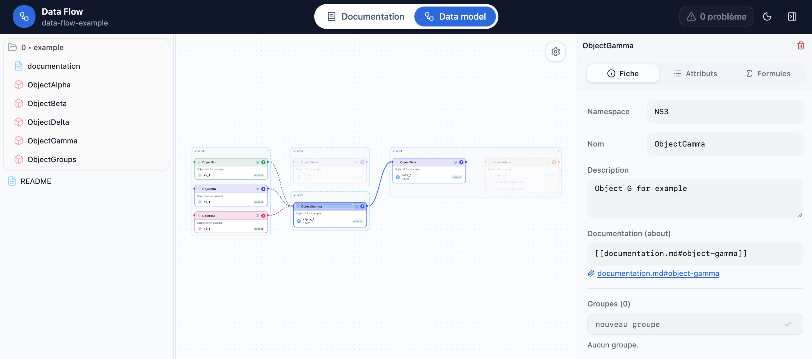

# Data Flow

Outil de modélisation et de documentation d'objets de données, fonctionnant **entièrement dans le navigateur** grâce à la **File System Access API**. Il ouvre un *notebook* (un répertoire local), lit ses fichiers YAML / Markdown / PDF / images et permet de les explorer, de les éditer et de visualiser les relations entre objets sous forme de graphe.



## Sommaire

- [Description](#description)
- [Prérequis](#prérequis)
- [Installation](#installation)
- [Lancement](#lancement)
- [Usage](#usage)
- [Fonctionnalités](#fonctionnalités)
- [Format des objets](#format-des-objets)
- [Développement](#développement)
- [Stack technique](#stack-technique)

## Description

Data Flow est un éditeur de modèle de données orienté « notebook » :

- un **notebook** est un répertoire contenant des fichiers YAML décrivant des objets, de la documentation Markdown, des PDF et des images ;
- chaque objet YAML possède un **namespace**, un **nom**, des **attributs** (éventuellement regroupés) et des **origines** (références et formules) ;
- les relations entre objets sont calculées à partir des références et affichées dans un **graphe groupé par namespace** ;
- la documentation Markdown peut être reliée aux objets via des **liens wiki**, rendue avec tableaux, formules mathématiques (KaTeX) et diagrammes **Mermaid**.

Aucun serveur n'est nécessaire : les fichiers sont lus et écrits directement sur le disque depuis le navigateur.

## Prérequis

- **Navigateur Chromium** récent (Chrome, Edge, Brave, Arc…) — l'API **File System Access** est requise.
- **Node.js 20+** et npm (uniquement pour lancer/compiler l'application).

## Installation

```bash
git clone <url-du-depot>
cd data-tool
npm install
```

## Lancement

```bash
npm run dev
```

Puis ouvrez l'URL affichée par Vite (par défaut http://localhost:5173) dans un navigateur Chromium.

Autres scripts :

| Script | Description |
| --- | --- |
| `npm run dev` | Serveur de développement Vite |
| `npm run build` | Build de production dans `dist/` |
| `npm run preview` | Prévisualisation du build |
| `npm run lint` | Analyse statique (oxlint) |
| `npm test` | Tests unitaires (Vitest) |

## Usage

1. **Ouvrir un notebook** : bouton « Ouvrir un notebook » ou glisser-déposer un répertoire sur l'écran d'accueil. Le répertoire est toujours choisi **manuellement** (le navigateur exige un geste utilisateur) ; le dernier notebook ouvert est mémorisé et proposé à la reprise.
2. **Explorer** les fichiers dans le panneau latéral gauche :
   - clic sur un fichier pour l'ouvrir ;
   - clic sur l'icône dossier pour déplier/replier ;
   - **clic droit** pour créer (Répertoire / Markdown / YAML), renommer ou supprimer ;
   - **double-clic** sur un nom pour le renommer ;
   - glisser-déposer pour réorganiser, ou importer des fichiers externes.
3. **Travailler dans les onglets centraux** :
   - **Documentation** : édite le fichier ouvert. Pour un YAML, l'éditeur de code est affiché à côté de son graphe ; pour un Markdown, un éditeur scindé avec rendu temps réel ; PDF et images s'affichent directement.
   - **Data model** : graphe global de tous les objets, regroupés par namespace, avec le panneau d'édition à droite.
4. **Éditer un objet** via le panneau de droite : namespace, nom, description, documentation (`about`), groupes, attributs (type, présence, exemple, origine/formule).
5. **Prettifier** un YAML avec le bouton en haut à droite de l'éditeur (ordonnancement et séparation des attributs/groupes).
6. **Documenter** un objet/attribut : renseignez `about: "[[documentation.md#section]]"`, puis cliquez sur l'icône ⓘ — le fichier ou la section est créé si nécessaire, et le titre est surligné.

## Fonctionnalités

- **File System Access** : lecture / écriture directe sur disque, sans serveur ; notebook mémorisé ; drag & drop et import de fichiers/répertoires.
- **YAML multi-documents** : un fichier = plusieurs objets, séparés par `---` ; `namespace` optionnel (racine par défaut).
- **Édition complète** : formulaires objet / groupe / attribut, édition du code source, création / renommage / suppression, sauvegarde automatique (`Ctrl/Cmd+S`).
- **Graphe par namespace** : regroupement à chaque niveau, repli/dépli, dépendances affichées, liens attributs↔attributs, détection des **conflits** (objet déclaré dans plusieurs fichiers, signalé en rouge avec liens vers les fichiers).
- **Éditeur de code CodeMirror** : coloration YAML / Markdown / CSS (thèmes Tomorrow clair / Yesterday sombre), numéros de ligne, repli, retour à la ligne, diagnostics inline et **console de traitement**.
- **Markdown enrichi** : tableaux (GFM), notes, formules (KaTeX), diagrammes **Mermaid**, HTML ; **`markdown.css`** personnalisable (fichier à la racine du notebook, éditable via le bouton paramètre du rendu, confiné au panneau de rendu).
- **Liens wiki** `[[fichier.md#section]]` sur les objets/attributs avec navigation et surlignage.
- **Recherche de code** : `Ctrl/Cmd+S` enregistre, navigation clavier dans l'explorateur.
- **Thème** clair/sombre.

## Format des objets

Un **notebook d'exemple** est disponible dans le dossier [`example/`](example/).
La description complète de son formalisme YAML (champs, types, références, sérialisation, schéma convertible) est décrite dans **[example/README.md](example/README.md)** — un bon point de départ pour comprendre la structure des objets et servir de notebook de test.

## Développement

```bash
npm run lint   # oxlint
npm test       # Vitest
npm run build  # build de production
```

Structure principale :

```
src/
  components/
    documents/   vues YAML, Markdown, PDF, image + breadcrumb
    editor/      CodeMirror, thème, console d'erreurs, repli
    graph/       graphe (@xyflow/react), nœuds, réglages
    panels/      explorateur, inspecteur, attributs, formules
    wiki/        liens `about`
  lib/
    fs/          File System Access (picker, handles, notebook)
    model/       parsing, schéma, référence, wiki, prettify, mutations
    store/       état Zustand
    layout/      disposition du graphe
```

## Stack technique

- **React 19** + **Vite**
- **@xyflow/react** (graphe)
- **CodeMirror 6** (`@uiw/react-codemirror`)
- **react-markdown** + `remark-gfm` / `remark-math` + `rehype-katex` / `rehype-raw` + **Mermaid**
- **yaml**, **zod**, **zustand**
- **File System Access API** (Chromium)
